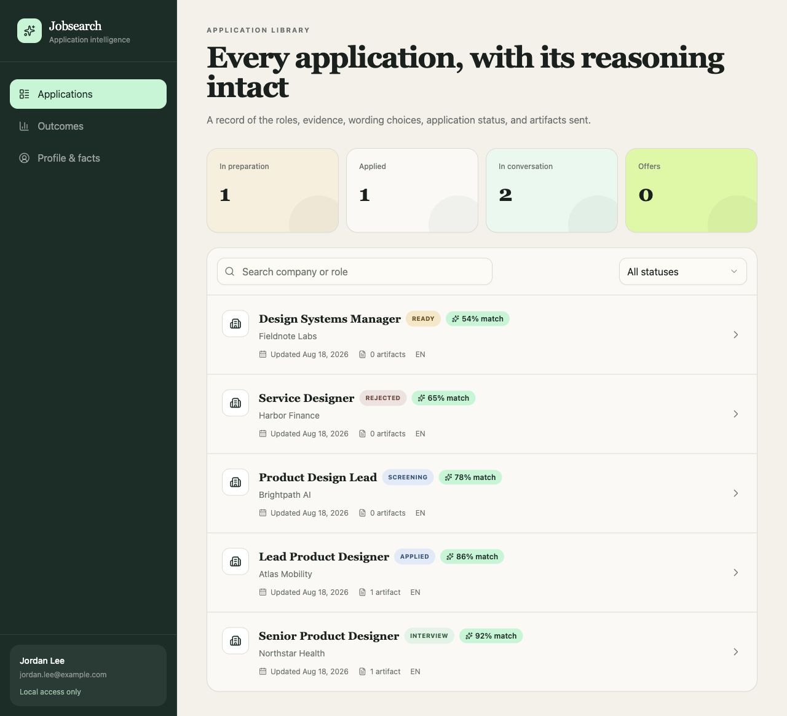
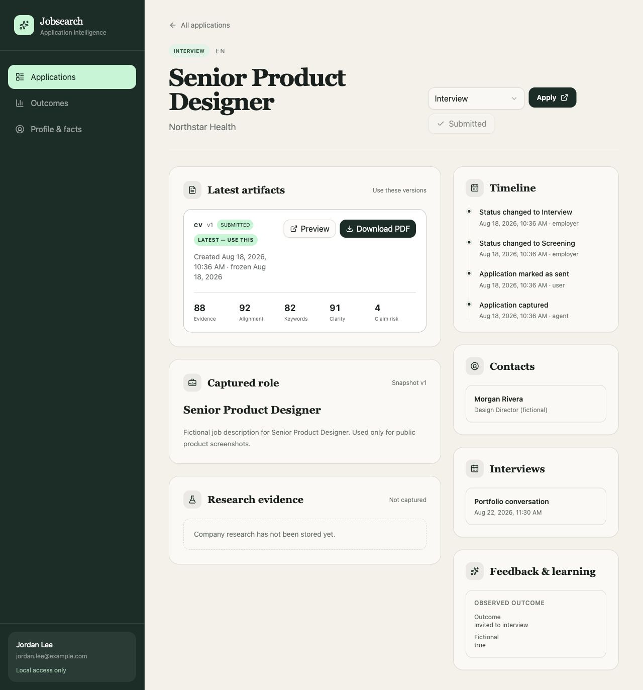

# Jobsearch

An evidence-led, local-first job-search workspace designed for people who want AI assistance without surrendering control of their career facts or application history.

**Product conceived and directed by [Eva Steen](https://www.eva-steen.com/); developed collaboratively with Codex.** Eva defined the problem, product behavior, evidence rules, workflow, privacy boundaries, and review criteria. Codex supported implementation, testing, documentation, and packaging under her direction.

[Complete user guide](docs/user-guide.md) · [Employer-facing case study](docs/case-study.md) · [View Eva's LinkedIn](https://www.linkedin.com/in/evasteen/) · [Portfolio](https://www.eva-steen.com/)



Jobsearch supports evidence-based job discovery, research, tailored applications, document rendering, application tracking, interviews, and outcome learning. Codex operates the guided workflow; the browser portal lets the user review applications, comparative match judgments, documents, and status.

## Why this project matters

Most job-search tools store listings or generate text. Jobsearch treats the full process as a traceable decision system: source evidence, verified career facts, job research, positioning choices, document revisions, submission state, employer outcomes, and learning stay connected.

The product demonstrates:

- product framing across a long, multi-stage user journey;
- responsible AI boundaries that prevent unverified claims from entering final application materials;
- progressive onboarding for nontechnical users;
- a local-first privacy model with explicit approval before external data sharing;
- a review portal with match judgments, immutable submitted artifacts, interview tracking, and outcome analytics;
- a reusable Codex workflow rather than a one-off prompt collection.

The detailed [case study](docs/case-study.md) explains the contribution boundary, product decisions, architecture, tradeoffs, validation, and use of Codex.

## Start here

This edition is designed for a nontechnical macOS user. Codex is the primary supported experience, and the repository also includes a Claude Code compatibility layer.

1. Open this repository in Codex.
2. Say: **“Set up Jobsearch for me.”**
3. Codex will check the Mac, install or configure required local software with permission, initialize the private database, and begin a guided profile interview.
4. Provide an existing CV, portfolio, professional profile export, or other career material when asked. The system can also build a profile through interview alone.
5. Codex will show the built-in Evidence CV template and ask whether to keep it, adapt it, or use another format.

The onboarding interview is progressive. It records answers in the profile, asks only for material gaps, and never borrows assumptions from another user.

For Claude Code, open the cloned folder and say: **“Read CLAUDE.md, set up Jobsearch for me, and begin the onboarding interview. I am not technical.”** A standard browser chat cannot install or operate the local application by itself.

See the [complete user guide](docs/user-guide.md) for permission, installation, onboarding questions, daily workflows, portal instructions, status tracking, privacy, backups, adaptation, and troubleshooting.

## What stays private

- PostgreSQL stores structured profile and application history on this Mac.
- Exact rendered HTML and PDF files live in the git-ignored `.local/artifacts` store.
- `.env`, `.local`, temporary files, generated documents, database backups, and personal source files are excluded from Git.
- External services must not receive personal material unless the user approves the provider and the specific data-sharing boundary.

Include `.local/artifacts` and `.local/backups` in Time Machine or an equivalent encrypted backup.

## Portal

After setup, ask Codex to start Jobsearch or run:

```bash
npm run dev
```

Open `http://127.0.0.1:5173`. The portal shows:

- the application library and stored match judgment;
- research, source snapshots, artifacts, and timeline;
- application workflow status from considering through accepted, rejected, withdrawn, or archived;
- profile facts and outcome analytics;
- previews and downloads for rendered CVs and cover letters.

Marking an application applied requires explicit confirmation and freezes the selected rendered artifact. Other status changes remain reversible and are retained in the event history.



The screenshots contain only fictional demonstration data. No real candidate, employer, application, CV, or contact data is stored in this repository.

## Adapting the system

Tell Codex what you want to change in ordinary language. Useful examples:

- “I want to target product operations roles in Germany.”
- “Never use this role in my CV unless I approve it.”
- “Keep my CV to two pages unless that removes important evidence.”
- “Show me the built-in CV template and help me adjust it.”
- “Use my own CV format instead.”
- “Ask before sending any personal data to an external service.”

Preferences are stored as profile data, not hidden in chat history. New career claims remain unverified until the user confirms them.

The built-in template content contract is documented in [docs/cv-content-contract.md](docs/cv-content-contract.md). Codex can generate a privacy-safe preview with `npm run template:preview`.

## Manual technical setup

Codex normally handles this section.

Requirements: macOS, Node.js 22 or newer, PostgreSQL, and Chromium for Playwright.

```bash
npm install
npm run setup:browser
npm run setup -- --name "Your Name" --email "you@example.com"
npm run jobsearch -- health
npm run jobsearch -- onboarding-status
npm run dev
```

Useful verification commands:

```bash
npm run check
npm run skill:validate
```

## Architecture

The CLI is the default mutation surface. The loopback-only portal may update application workflow status and confirm actual submission. PostgreSQL stores queryable records, while rendered files use a private content-addressed local store. All application artifacts and evidence revisions are append-only.

See [docs/architecture.md](docs/architecture.md) for the system boundaries and [AGENTS.md](AGENTS.md) for the operating contract.

## Source availability

This repository is publicly readable as a portfolio and evaluation artifact, but it is **not open source**. No open-source license is granted. See [NOTICE.md](NOTICE.md) for the use boundary and [the user guide](docs/user-guide.md#permission-to-install-or-adapt-it) for how to authorize a specific person.
