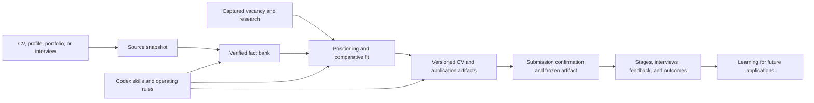
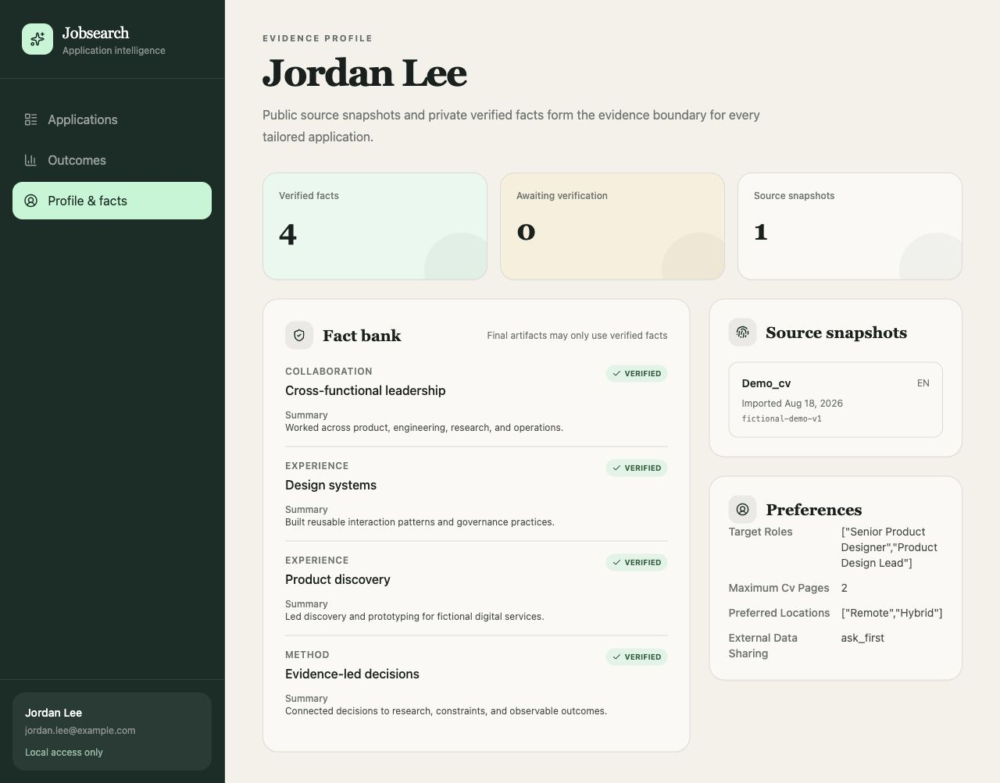

# Jobsearch: from personal workflow to evidence-led product

## Snapshot

| | |
|---|---|
| **Problem** | AI can accelerate a job search, but fragmented tools lose evidence, decisions, document history, and outcome learning. Generative systems may also turn uncertainty into unsupported claims. |
| **Product** | A local-first, Codex-operated workspace connecting verified career evidence, job research, comparative fit judgments, tailored artifacts, application stages, interviews, and outcomes. |
| **Role** | Product conceived and directed by Eva Steen; developed collaboratively with Codex. |
| **Eva's contribution** | Problem framing, workflow and information architecture, product requirements, evidence policy, interaction decisions, privacy boundaries, iterative review, and release criteria. |
| **Codex contribution** | Implementation support, code generation and revision, automated tests, documentation, rendering, sanitization, and validation under Eva's direction. |
| **Current state** | Working local product and reusable framework for nontechnical macOS users. Public screenshots use only fictional data. |

## The problem

A serious job search produces more than a list of vacancies. Each opportunity accumulates a source listing, company research, eligibility questions, a fit judgment, positioning decisions, CV and cover-letter revisions, contacts, interviews, feedback, and an eventual outcome.

When those pieces live across browser tabs, chats, folders, and memory, important context disappears. A generated document may be difficult to trace back to evidence. A later application cannot reliably learn from earlier outcomes. The user also has little visibility into what the AI assumed or changed.

Eva began with her own working process and turned it into a product question:

> How might a job seeker use an AI collaborator throughout the application journey while keeping career claims truthful, decisions inspectable, and personal data under the user's control?

## Product principles

1. **Evidence before prose.** Final application materials may use only verified career facts or an exact imported source snapshot.
2. **Uncertainty stays visible.** Source facts, employer feedback, observed outcomes, agent hypotheses, and validated findings remain separate evidence classes.
3. **The user confirms consequential state.** An application cannot be marked applied without explicit confirmation and a frozen rendered artifact.
4. **History is a product feature.** Research, decisions, scorecards, drafts, and events are retained instead of overwritten.
5. **Private by default.** The database and rendered documents remain on the user's Mac; external sharing requires an explicit boundary.
6. **Nontechnical operation.** A new user can ask Codex to set up the system, import an existing CV or start an interview, and adapt preferences in ordinary language.

## Key decisions and tradeoffs

### Local-first instead of cloud signup

The first distributable edition uses local PostgreSQL, loopback-only servers, and a private content-addressed artifact store. This avoids a central store of CVs and application histories and removes account/authentication complexity.

The tradeoff is setup: PostgreSQL, Node.js, and browser dependencies must exist on the Mac. Guided Codex onboarding absorbs that complexity for a nontechnical user and asks permission before installing software.

### Evidence model instead of unconstrained generation

Career claims are stored with verification state and evidence. New information begins as unverified; final artifacts reference verified fact IDs and the profile-source snapshot used.

This adds friction compared with a generic “write my CV” prompt. The benefit is a defensible boundary against invented metrics, strengthened titles, or implied experience.

### CLI ownership with a focused review portal

The CLI is the primary mutation surface because it can preserve structured context and enforce invariants. The portal supports the decisions that benefit from direct human review: application status, submission confirmation, document previews, fit visibility, timelines, interviews, and outcomes.

This is deliberately narrower than a full browser CRUD interface. It keeps complex evidence mutations in one controlled workflow while making daily tracking accessible.

### Comparative match judgment, not an invented hiring probability

The application list exposes a stored fit score so the user can compare opportunities. It is described as a judgment based on the recorded positioning strategy—not a prediction that an employer will interview or hire the candidate.

### Optional built-in CV system

The framework keeps a restrained, ATS-conscious Evidence template as a usable default. Onboarding asks whether the user wants to keep it, adapt it, or provide another format. The renderer does not silently impose a previous user's preferences.

## System model

- PostgreSQL stores queryable profiles, facts, applications, events, research, contacts, interviews, and artifact metadata.
- A git-ignored, content-addressed local store holds exact HTML and PDF renders.
- The React portal and Hono API bind only to loopback addresses.
- Repository skills encode onboarding, application, CV, and professional-writing workflows.

## Product surfaces

### Application library

The library combines portfolio-level signals with the individual opportunity list: workflow counts, search and filtering, current status, artifact count, language, and comparative fit.

### Application detail and history

The detail view joins the latest usable artifact, quality scorecard, captured role, research state, application timeline, contacts, interviews, and feedback. Submitted artifacts are immutable.

### Evidence profile

The profile makes the AI's evidence boundary inspectable: verified facts, facts awaiting confirmation, imported source snapshots, and personal workflow preferences.

All names, employers, vacancies, contacts, dates, descriptions, scores, and outcomes shown above are fictional demonstration content.

## How Codex was used

Codex was treated as a product-development collaborator, not as an invisible authorship shortcut. Eva supplied the lived workflow, requirements, corrections, priority decisions, and acceptance criteria. Codex helped translate those decisions into architecture, code, migrations, tests, copy, documentation, and a sanitized distributable edition.

Human control remained explicit:

- Eva decided what the system should do and corrected behavior that did not reflect her process.
- Personal facts and submission state require user confirmation.
- Generated changes were tested, built, visually inspected, and privacy-scanned.
- The public edition states the contribution boundary rather than implying that every implementation detail was hand-coded by one person.

## Validation

The publication candidate was checked through several independent surfaces:

- 34 automated tests across contracts, identity, filenames, rendering, language validation, API behavior, artifact storage, and application-state invariants;
- successful TypeScript and production builds;
- validation of four repository skills;
- extracted-text and visual review of the built-in CV renderer;
- an isolated end-to-end demo database containing only fictional records;
- visual review of the application library, detail, and evidence-profile pages;
- tracked-file and Git-history privacy scans;
- zero known production dependency vulnerabilities at the publication review on 18 August 2026.

The isolated demo run also exposed a misplaced status invariant: a guard intended to prevent unverified “applied” status changes had been attached to document creation. The public-release change moves that guard to the status operation, demonstrating why end-to-end validation complements unit tests.

These checks establish implementation quality and traceability; they do not claim that a fit score predicts hiring outcomes or that the product has been validated at market scale.

## Result and current limitations

The result is a functioning personal product and a reusable local framework that can:

- onboard a new user from existing material or an interview;
- capture and compare opportunities;
- keep evidence, research, decisions, documents, and outcomes connected;
- render and freeze application artifacts;
- expose the workflow in a review portal; and
- adapt through natural-language preferences without inheriting another user's assumptions.

The current edition is intentionally local and single-user. It has not yet been validated as a hosted multi-tenant service, and it does not claim recruiter adoption or improved hiring outcomes. Those are future research questions, not inferred results.

## What I would explore next

1. Observe several first-time users completing onboarding without technical help.
2. Test which match explanation is most useful alongside the numeric judgment.
3. Add an export/import path that preserves privacy and provenance between Macs.
4. Evaluate an optional hosted edition only after defining encryption, tenancy, deletion, and consent requirements.
5. Compare outcome patterns over enough applications to distinguish repeated findings from attractive hypotheses.
